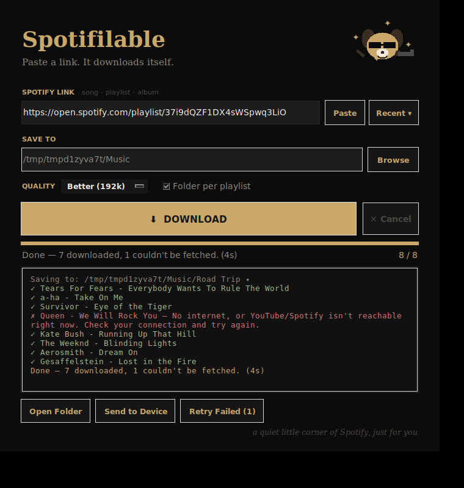

# Spotifilable

Paste a Spotify song / playlist / album link, pick a folder, press **Download**.
It does the rest quietly in the background — with a real progress bar, a live
✓ / ✗ log, and a cool little sunglasses dog keeping you company.



## What it does

- **Auto-grabs the link** — copy a Spotify link anywhere, open the app, it's already in the box
- **Paste / Recent ▾** — one-click paste, and a menu of every playlist you've done before
- **Quality** — Good / Better / Best (mp3 at 128k / 192k / 320k)
- **Folder per playlist** — keeps things tidy: `Music/Spotifilable/<Playlist name>/`
- **Progress bar + counter + elapsed time**, never looks frozen (status ticks with seconds)
- **Cancel** (stops after the current track) — or press `Esc`. `Enter` starts a download.
- **Retry Failed** — network blip? one click retries just the ones that failed
- **Open Folder** — jump straight to the music
- **Send to Device** — copies the songs onto a Walkman / USB stick / SD card
  (finds removable drives automatically, puts them in a `MUSIC` folder)
- **Skips what you already have**, so re-running a playlist only grabs new songs
- **Plain-English errors** ("No internet…", "Is the playlist private?")
- Remembers your folder + quality between runs. Mascot has moods.

## Run from source

```
pip install -r requirements.txt
python spotifilable.py
```

First download ever: it asks permission once to fetch a small audio helper
(FFmpeg, ~80 MB). Click **Yes**. Never asked again.

## Build the one-file .exe (so she just double-clicks an icon)

A Windows `.exe` has to be built on Windows. Two ways:

**A) Let GitHub build it for free (no Windows PC needed)**

1. Make a free GitHub account + a new repository
2. Upload `spotifilable.py`, `icon.ico`, `requirements.txt` and the folder
   `.github/workflows/build.yml` (keep that exact folder structure)
3. Repo → **Actions** tab → **Build Spotifilable.exe** → **Run workflow**
4. ~3 minutes later, open the finished run and download the
   **Spotifilable-windows** artifact — that zip contains `Spotifilable.exe`

**B) On any Windows PC**

```
pip install -r requirements.txt pyinstaller
pyinstaller --onefile --windowed --icon=icon.ico --name Spotifilable ^
  --add-data "icon.ico;." ^
  --collect-all spotdl --collect-all yt_dlp --collect-all ytmusicapi ^
  spotifilable.py
```

Result: `dist/Spotifilable.exe`. **That single file is the whole app.**

## Sending it to her

Send `Spotifilable.exe`. She double-clicks it. That's it.

Windows SmartScreen may show "Windows protected your PC" the first time
(the exe isn't code-signed — normal for small personal apps). She clicks
**More info → Run anyway**, once.

## Notes

- Built on [spotDL](https://github.com/spotDL/spotify-downloader): Spotify is
  used only for track/playlist *information*; the audio itself is matched from
  YouTube, because Spotify's own audio is DRM-protected and no third-party app
  can download it.
- The occasional track that can't be matched shows in red — press Retry Failed
  later, or it may simply not exist on YouTube.
- For personal listening only.

## Files

| file | what |
|---|---|
| `spotifilable.py` | the whole app (one file) |
| `icon.ico` / `icon.png` | app icon |
| `requirements.txt` | `spotdl` |
| `.github/workflows/build.yml` | builds the .exe on GitHub's Windows machines |
| `test_app.py` | offline test-suite (fake spotDL backend) — `python test_app.py` |
